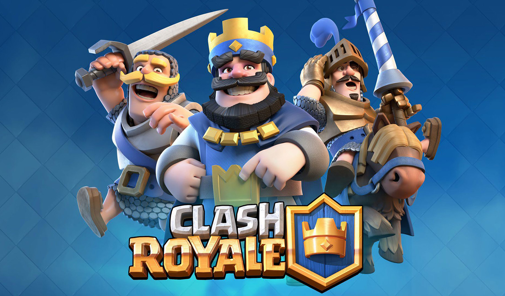
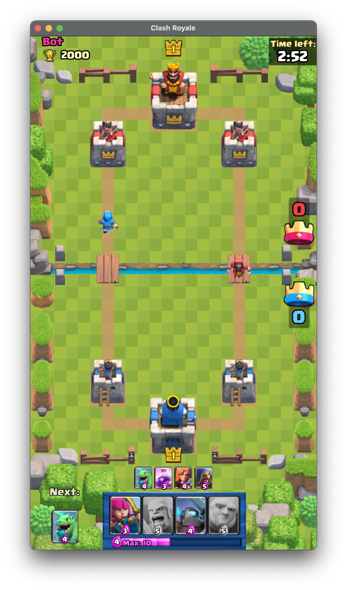
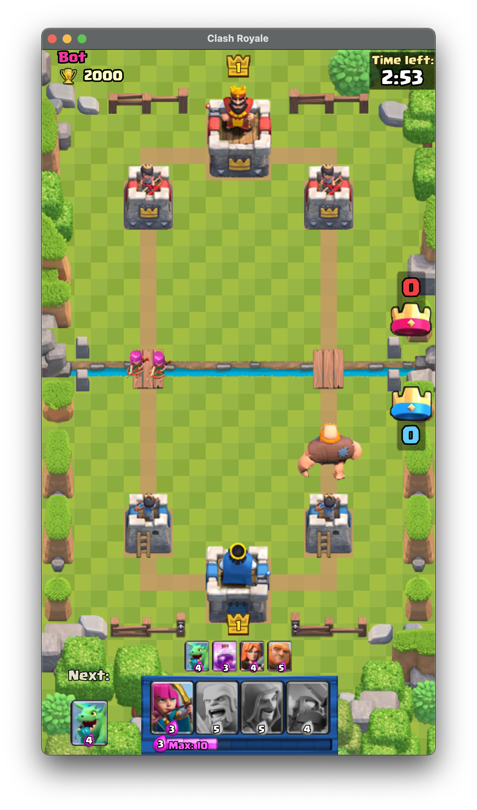
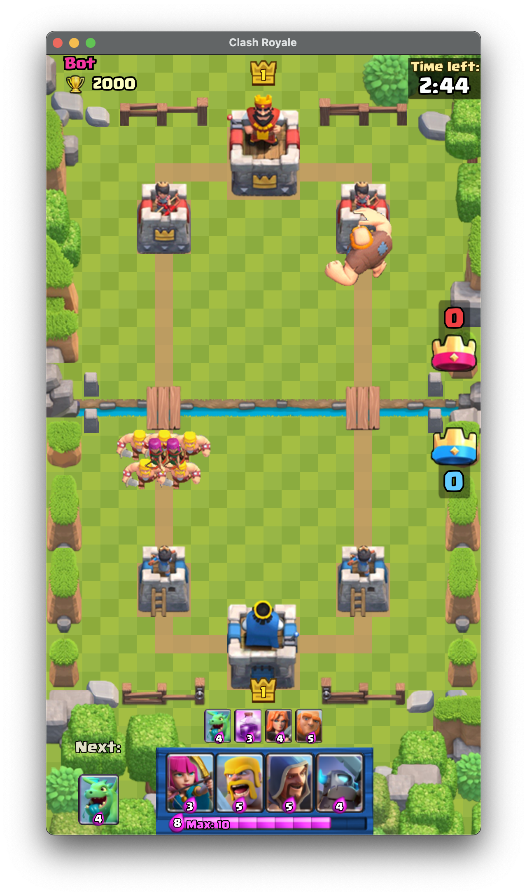
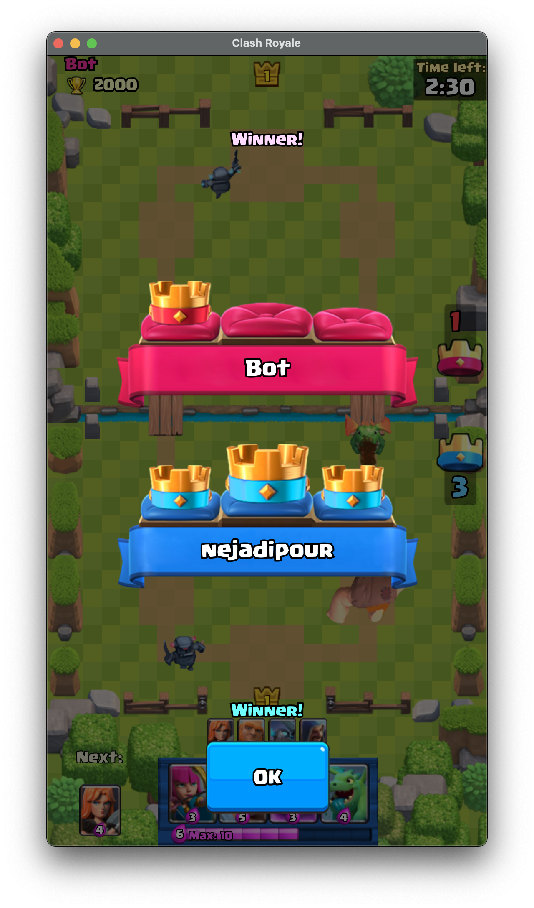

# Clash Royale 

  

In spring 2020, in [Amirkabir University of Technology](aut.ac.ir), for advanced programming class, the students were
tasked to create a simpler version of [Clash Royal Game](https://supercell.com/en/games/clashroyale/) using javafx, and
java-core.  

## Developers 

This project was developed by [Sina Shariati](https://github.com/Noisyboy-9) and
[Alireza Nejadipour](https://github.com/nejadipour).  

# Game Elements

The game had some factors such as:

- Towers
- Cards
- 3D client
- online game

## Towers

The game had two kind of towers:

- King Tower (for documentation click [here](documentation/markdowns/KingTower.md))
- Queen Tower (for documentation click [here](documentation/markdowns/QueenTower.md))

## Cards

Clash Royale has three kind of cards: Troops, Buildings, Spells

### troops

The list of Troops:

- Barbarians (for documentation click [here](documentation/markdowns/Barbarians.md))
- Archers (for documentation click [here](documentation/markdowns/Archers.md))
- Baby Dragon (for documentation click [here](documentation/markdowns/BabyDragon.md))
- Wizard (for documentation click [here](documentation/markdowns/Wizard.md))
- Mini Peka (for documentation click [here](documentation/markdowns/MiniPeka.md))
- Giant (for documentation click [here](documentation/markdowns/Giant.md))
- Valkyrie (for documentation click [here](documentation/markdowns/Valkyrie.md))

### spells

The list of spells:

- Rage (for documentation click [here](documentation/markdowns/Rage.md))
- Fire Ball (for documentation click [here](documentation/markdowns/FireBall.md))
- Arrows (for documentation click [here](documentation/markdowns/Arrows.md))

### buildings

The list of buildings:

- Cannon (for documentation click [here](documentation/markdowns/Cannon.md))
- Inferno Tower(for documentation click [here](documentation/markdowns/InfernoTower.md))

## 3D client

In this project we tried to use 3D elements to make the UI better, and also make the game much more similar to the main
game. some screenshots of the main game area:  

## Online Game

In this project we tried to implement online mode using a command caster server that receives commands from clients and
broadcasts it between all clients.

## UML design

The design that we did for the game can be found
in [here](https://drive.google.com/file/d/13oxQ13O96AFQbgB-VbPRhfSL33D8UyjD/view?usp=sharing).
