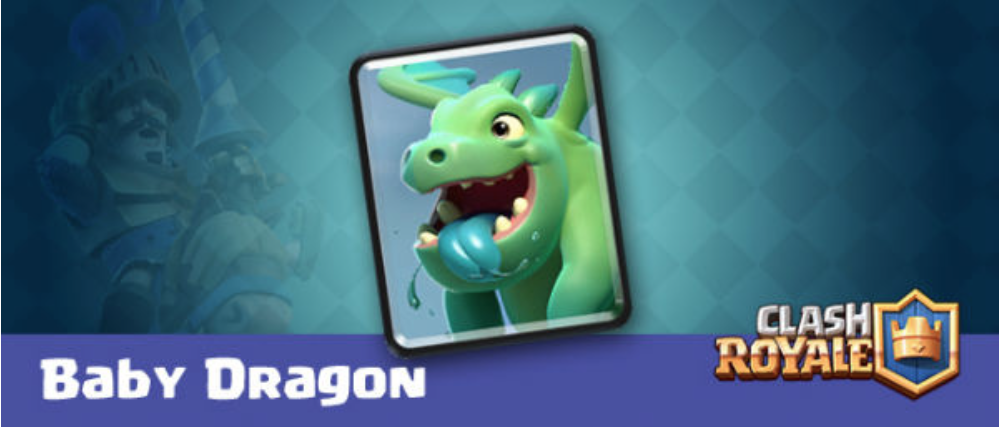
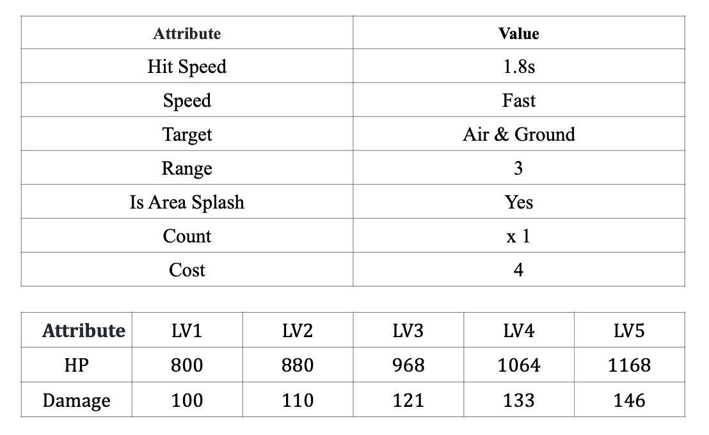

# Baby Dragon

 
This card will place 1 Baby Dragon in map. 
It will cost 4 elixirs. 
Baby Dragons have area with the radius of 3.5 tiles.  
Baby Dragon is an air target, but can target both air and ground units.

stats:  

