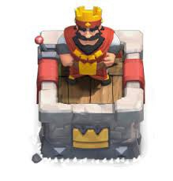
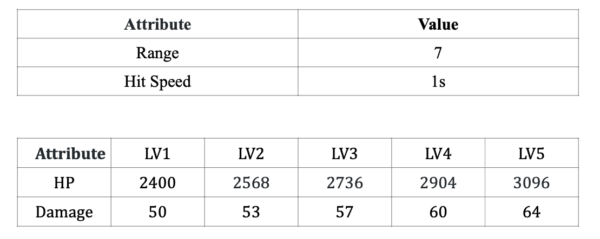

# King Tower

 
The main tower of the game. 
by default it's inactive but when it's damaged it will be activated.  
if a player losses it's king tower the game is over, and they are the loser.

stats:  

